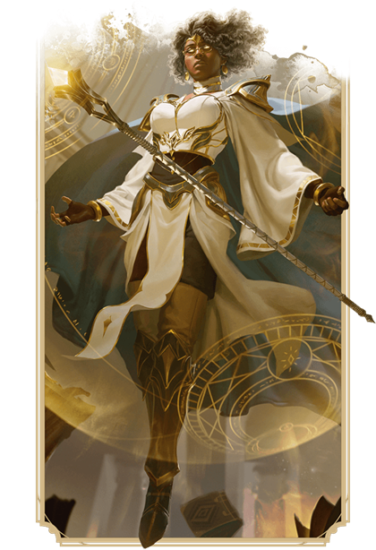

  

# Magicien <!-- {docsify-ignore} -->

---

  

    
Un érudit utilisateur de magie et de pouvoir arcanique

  

  

    
Les magiciens lancent des sorts de feu explosif, d'éclairs en arc, de tromperie subtile et de transformations spectaculaires.

    

      
<strong>Caractéristique principale :</strong> Intelligence

      
<strong>Points de vie :</strong> D6

      
<strong>Sauvegardes :</strong> Intelligence et Sagesse

    

  

  

  

# Capacités de classe
| | |
| --------------------------- | |
| **Caractéristique principale** | Force |
| **Dé de point de vie** | D12 par niveau de barbare |
| **Maîtrises de jet de sauvegarde** | Force et Constitution |
| **Maîtrises de compétences** | *Choisissez 2:* Dressage, Athlétisme, Intimidation, Nature, Perception et Survie |
| **Maîtrises d'arme** | Armes courantes et armes martiales |
| **Maîtrise d'armure** | Armure Légère, Intermédiaire et Boucliers |
| **Équipement de départ** | *Choisissez A ou B:* (A) Hache à deux mains, 4 Haches de lancer, Sac d'explorateur et 15 PO; ou (B) 75 PO |