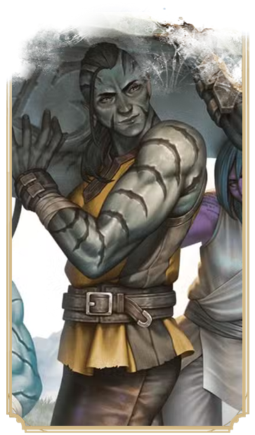

  

# Goliath <!-- {docsify-ignore} -->

---

  

    
Les Goliaths sont de lointains descendants de géants et recherchent des hauteurs supérieures à celles atteintes par leurs ancêtres.

  

  

  

